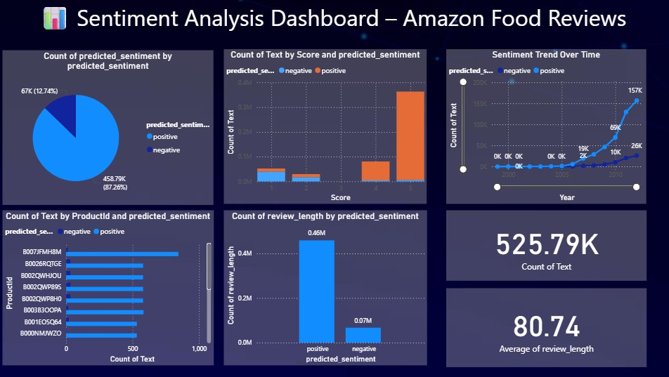

# 📊 Sentiment Analysis of Amazon Fine Food Reviews

  
*Machine Learning • NLP • Power BI Dashboard*

---

## 🚀 Overview

This project demonstrates a complete pipeline for **Sentiment Analysis** on real-world Amazon food review data.  
It combines **NLP and Machine Learning** to classify reviews into **positive** or **negative** sentiments, and visualizes key insights using a fully interactive **Power BI Dashboard**.

---

## 🧠 Problem Statement

Build a sentiment analysis system that processes textual data from customer food reviews and classifies opinions as positive or negative.  
Use **Logistic Regression** for classification, followed by visual storytelling using **Power BI**.

---

## 📁 Dataset

- **Source:** [Amazon Fine Food Reviews – Kaggle](https://www.kaggle.com/datasets/snap/amazon-fine-food-reviews)  
- **Size:** ~500,000 reviews  
- **Key Columns:**
  - `Text`: Full review text  
  - `Score`: Original rating (1 to 5 stars)  
  - `Time`: Timestamp  
  - `ProductId`, `UserId`, `Helpfulness`, `Summary`

---

## 🛠️ Tools & Technologies

| Python | NLP | ML Model | Visualization |
|--------|-----|----------|---------------|
| pandas, seaborn, matplotlib | TF-IDF (sklearn) | Logistic Regression | Power BI |

---

## 🔍 Project Workflow

### 1️⃣ Data Cleaning & Preprocessing
- Removed duplicates, nulls  
- Converted Unix `Time` to datetime  
- Filtered out neutral scores (3 stars)  
- Engineered `sentiment` label:
  - 1–2 stars → **negative**  
  - 4–5 stars → **positive**

### 2️⃣ NLP Feature Extraction
- Applied **TF-IDF Vectorizer** (max 5000 features, English stopwords removed)

### 3️⃣ Model Training & Evaluation
- Algorithm: **Logistic Regression**  
- Data split: 80% train / 20% test  
- Metrics:
  - **Precision, Recall, F1-Score**
  - **Confusion Matrix** plotted using seaborn

### 4️⃣ Exported Predictions
- Final DataFrame saved as `sentiment_output.csv` with:
  - Review Text
  - Actual Sentiment
  - Predicted Sentiment
  - Time, Score, Product ID

### 5️⃣ Power BI Dashboard
- Imported `sentiment_output.csv`  
- Created the following visuals:
  - 📊 Sentiment Distribution (Pie Chart)
  - 📈 Sentiment Flow Over Time (Line Chart)
  - 🏆 Top Reviewed Products (Bar Chart)
  - 📏 Review Length vs Sentiment (Stacked Bar)
  - 🔢 KPI Cards (Total Reviews, Average Length)
  - 📌 Category-wise Sentiment Filter (Slicers)

---

## 📸 Dashboard Preview

---

## 🔗 Useful Links

- 📁 **Dataset:** [Amazon Fine Food Reviews – Kaggle](https://www.kaggle.com/datasets/snap/amazon-fine-food-reviews)  
- 💻 **GitHub Repo:** [Click Here](https://github.com/shauryaverma03/Sentiment-Analysis-Using-Machine-Learning)  
- 📹 **LinkedIn Video Post:** [Click Here](https://www.linkedin.com/feed/update/urn:li:activity:7351348628013129730/)  

---

## 📬 Contact

For queries, feedback, or collaborations:  
**📧 Shaurya Verma – [shauryaverma036@gmail.com]**  
**🌐 LinkedIn – [https://linkedin.com/in/shaurya47](https://linkedin.com/in/shaurya47)**

---

⭐ *If you liked this project, please give it a star on GitHub!*
